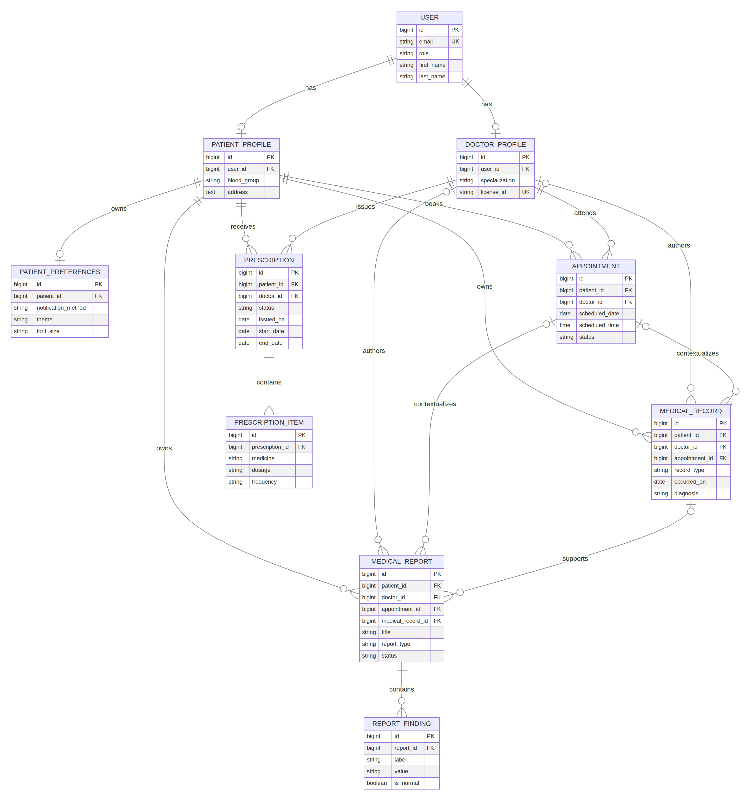

# MediCare Phase 5 Database Schema

## Scope

This schema is the first persistent MediCare domain foundation. It is implemented as Django models and migration files, but it is not connected to the user’s Windows PostgreSQL from the Manus sandbox. No sample or real patient data is included.

## Django applications

| App | Models |
|---|---|
| `accounts` | `User`, `PatientProfile`, `DoctorProfile`, `PatientPreferences` |
| `appointments` | `Appointment` |
| `medical_records` | `MedicalRecord` |
| `prescriptions` | `Prescription`, `PrescriptionItem` |
| `reports` | `MedicalReport`, `ReportFinding` |
| `health` | No database model; existing health endpoint only |

## Textual ER-style description

```text
User 1 ─── 0..1 PatientProfile
User 1 ─── 0..1 DoctorProfile
PatientProfile 1 ─── 0..1 PatientPreferences

PatientProfile 1 ─── N Appointment N ─── 1 DoctorProfile
PatientProfile 1 ─── N MedicalRecord N ─── 0..1 DoctorProfile
MedicalRecord 0..1 ─── N MedicalReport
Appointment 0..1 ─── N MedicalRecord
Appointment 0..1 ─── N MedicalReport

PatientProfile 1 ─── N Prescription N ─── 1 DoctorProfile
Prescription 1 ─── N PrescriptionItem

PatientProfile 1 ─── N MedicalReport N ─── 0..1 DoctorProfile
MedicalReport 1 ─── N ReportFinding
```

The `User` row is the shared identity foundation. Patient and doctor profiles extend it through one-to-one relationships. Clinical records use protected patient deletion so medical history cannot disappear through ordinary parent deletion. Optional doctor, appointment, and medical-record references use `SET_NULL` where the record should survive without the related context.



## Important fields

| Model | Important fields |
|---|---|
| `User` | Unique email, first/last name, phone, date of birth, gender, role, active/staff flags, date joined |
| `PatientProfile` | User, blood group, address, timestamps |
| `DoctorProfile` | User, specialization, optional unique license ID, contact details, timestamps |
| `PatientPreferences` | Notification flags, notification method, theme, font size, timestamps |
| `Appointment` | Patient, doctor, scheduled date/time, status, reason, notes, timestamps |
| `MedicalRecord` | Patient, optional doctor/appointment, type, date, diagnosis, notes, optional attachment, timestamps |
| `Prescription` | Patient, doctor, status, issued/start/end dates, timestamps |
| `PrescriptionItem` | Prescription, medicine, dosage, frequency, duration, dates, instructions, side effects |
| `MedicalReport` | Patient, optional doctor/appointment/medical record, title, type, laboratory, date, status, summary, interpretation, attachment, timestamps |
| `ReportFinding` | Report, label, value, normal flag, sort order |

## Constraints and indexes

The schema includes a unique email on `User`, a unique optional doctor license identifier, a unique doctor/date/time appointment slot, date-order check constraints on prescriptions and prescription items, and indexes for common patient/doctor/date/status access patterns. Repeated prescription medicines and report findings are normalized into child rows rather than serialized lists.

## Authentication foundation

`User` uses Django’s custom-user foundation with email as `USERNAME_FIELD`, `AbstractBaseUser`, and `PermissionsMixin`. This decision is made before initial migrations so Phase 6 can add authentication without replacing the identity table. Phase 5 does not implement login, registration, JWT, sessions, role permissions, password-reset flows, or authentication APIs.

## AI data decision

No AI-related model is created. The current AI insights page performs local demo symptom matching and explicitly labels its prediction as a non-diagnostic demo. Persistent prediction, explainability, chatbot, RAG, and AI insight models require a future API and safety design.

## Migration files

Each domain app has an initial migration under `backend/apps/<app>/migrations/0001_initial.py`. The migrations are project files intended for execution on the user’s Windows PostgreSQL after `backend/.env` is configured. They were generated and validated in the sandbox without connecting to PostgreSQL.

## Deferred work

Authentication implementation, complete REST APIs, frontend integration, AI, audit logging, clinical file storage authorization, database seed data, and production privacy controls are deferred to later phases.
